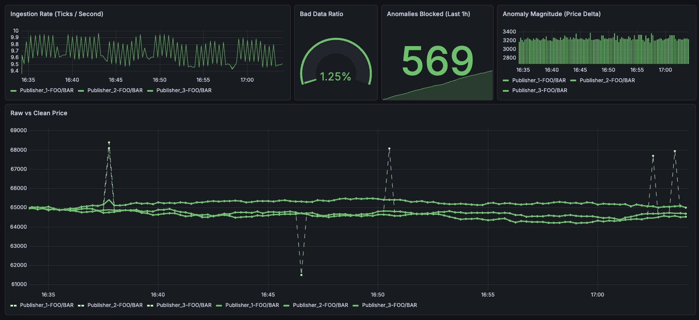

# HungryHippo: Real-Time Market Data Anomaly Corrector

HungryHippo is a high-throughput, event-driven pipeline designed to ingest streaming market data, detect statistical anomalies in real-time, and utilize an AI Autoencoder to reconstruct and publish sanitized price trends without halting the data stream.



## System Architecture & Tech Stack
The system operates as a multi-language microservice architecture built for deterministic ingestion and probabilistic correction.

* **Message Broker (Kafka in KRaft mode):** Manages the `raw_market_ticks` (input) and `clean_market_ticks` (output) streams.
* **Producer (Python):** Simulates a high-frequency cryptocurrency feed (100ms ticks). Randomly injects massive 5% price anomalies ~1% of the time.
* **Ingestor (Elixir / OTP / Broadway):** Subscribes to Kafka. Routes ticks to isolated GenServers partitioned by `feed_id`. Maintains a strict 50-tick rolling chronological window in memory.
* **Native Analytics (Rust / Rustler):** A deterministic statistical engine wrapped as an Elixir NIF. Utilizes Welford's online algorithm to calculate rolling means, variance, and Z-scores on the fly.
* **AI Oracle (Python / PyTorch / FastAPI):** A probabilistic corrector running a pre-trained LSTM Autoencoder (`autoencoder_model.pth`).
* **Observability (Prometheus & Grafana):** Elixir emits `:telemetry` metrics scraped by Prometheus to visualize pipeline health, anomaly magnitudes, and the Raw vs. Clean data divergence.

### 📄 Data Contracts & Schemas
To ensure seamless communication between the Python and Elixir microservices, all JSON payloads traversing Kafka and the HTTP Oracle APIs are strictly defined.
* **Please review the [DATA_CONTRACTS.md](./docs/DATA_CONTRACTS.md) file for the exact JSON schemas and expected data types before modifying the pipeline.**

## The Data Pipeline Flow
1. **Ingestion:** Producer pushes a JSON tick to `raw_market_ticks`.
2. **Buffering:** Elixir's Broadway pulls the tick, updates the 50-tick buffer, and passes the state to the Rust NIF.
3. **Detection (Rust):** Rust evaluates the Z-score (requires a 50-tick warm-up phase).
   * **Path A (Standard Throughput):** Z-score < 3.0. Elixir immediately publishes the raw tick to `clean_market_ticks`.
   * **Path B (Anomaly Detected):** Z-score > 3.0. Elixir pauses the stream and POSTs the 50-tick window to the AI Oracle.
4. **Correction (Python):** The Oracle masks the anomalous tick, scales the 50-tick window, and passes it through the LSTM to predict the true intended price.
5. **Egress:** Oracle returns the corrected price. Elixir logs the divergence delta and publishes the sanitized tick to `clean_market_ticks`.

## Docker Operations & Quick Start
The entire infrastructure is containerized and managed via Docker Compose.

### Startup Commands
To perform a standard boot:
```bash
docker compose up -d --build